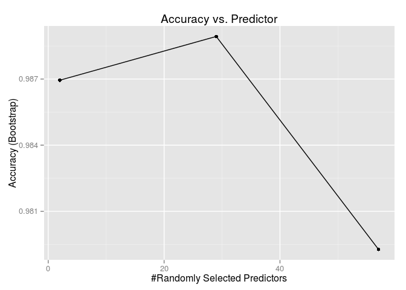

# Human Activity Recognition Machine Learning
Francois Schonken  

### Synopsis
This report endeavours to apply machine learning the Human Activity Recognition [Weight Lifting Exercises Dataset](http://groupware.les.inf.puc-rio.br/har#weight_lifting_exercises) in an effort to predict the ```classe``` of a sinlge bi-cep curl. We start by exploring the 160 variable dataset and the removing variables (columns) we do not feel add value to our machine learning endevour. We then split our training data into train and test subsets. We implement a Random Forest machine learning strategy against the train data and then proceed to review our outside error rate by applying our model to the test subset. In conclusion we prepare the predictions for the 20 test cases provided.

### Data Dictionary
The data dictionary spans 160 variables. In an effort to keep this lean I refer you [here](http://groupware.les.inf.puc-rio.br/har#weight_lifting_exercises#ixzz3MWksZVLK) should you wish to read more on the detail contained in this dataset. One element I wish to elaborate of however is the meaning of the various classe detailed below: 

Classe | Definition
-------|-----------
Class A | Exactly according to the specification
Class B | Throwing the elbows to the front
Class C | Lifting the dumbbell only halfway 
Class D | Lowering the dumbbell only halfway
Class E | Throwing the hips to the front

### Data Processing
Start by initializing a few R libraries. Turn echo on for R code chunks, center figures and suppress messages. We also hard code the seed value in an effort to achive reproducibility.

```r
require(knitr)
require(ggplot2)
library(dplyr)
library(caret)

set.seed(98765)
opts_chunk$set(echo=TRUE, fig.align='center', message=FALSE, cache=TRUE)
```

We read the training and testing data into the ```dataTrain.raw``` and ```dataTest.raw``` variables respectively. 

```r
if (!exists("dataTrain.raw")){dataTrain.raw <- read.csv('data/pml-training.csv')}
if (!exists("dataTest.raw")){dataTest.raw <- read.csv('data/pml-testing.csv')}
```

### Cleaning 
Folowing the above mentioned dataset reads we review the ```dataTrain.raw``` data frame using both ```summary(dataTrain.raw)``` and ```head(dataTrain.raw)```. The output of the ```summary(dataTrain.raw)``` and ```head(dataTrain.raw)``` command have been relegated to dedicated Appendixes in an effort to keep this section clean and easy to read. 

From the cursory review of the data is becomes very clear many of the fields are only populated when the ```New_Window``` variable is Yes and as far as we can tell this adds no value to our training exercise. We create the following function to drop the vaiables we do not believe will add value to our machine learing.  


```r
pml_data_column_cleanup = function(df){
  # Drop purely admin related columns
  df <- df %>% select(-starts_with("X"))
  df <- df %>% select(-starts_with("raw_timestamp_"))
  df <- df %>% select(-starts_with("cvtd_timestamp"))
  df <- df %>% select(-starts_with("new_window"))
  df <- df %>% select(-starts_with("num_window"))
  
  # Drop columns that relate only to "New Window = Yes"
  df <- df %>% select(-starts_with("kurtosis_roll_"))
  df <- df %>% select(-starts_with("kurtosis_picth_"))
  df <- df %>% select(-starts_with("kurtosis_yaw_"))
  
  df <- df %>% select(-starts_with("skewness_roll_"))
  df <- df %>% select(-starts_with("skewness_pitch_"))
  df <- df %>% select(-starts_with("skewness_yaw_"))
  
  df <- df %>% select(-starts_with("max_roll_"))
  df <- df %>% select(-starts_with("max_picth_"))
  df <- df %>% select(-starts_with("max_yaw_"))
  
  df <- df %>% select(-starts_with("min_roll_"))
  df <- df %>% select(-starts_with("min_pitch_"))
  df <- df %>% select(-starts_with("min_yaw_"))
  
  df <- df %>% select(-starts_with("amplitude_roll_"))
  df <- df %>% select(-starts_with("amplitude_pitch_"))
  df <- df %>% select(-starts_with("amplitude_yaw_"))
  
  df <- df %>% select(-starts_with("var_total_accel_"))
  
  df <- df %>% select(-starts_with("avg_roll_"))
  df <- df %>% select(-starts_with("stddev_roll_"))
  df <- df %>% select(-starts_with("var_roll_"))
  
  df <- df %>% select(-starts_with("avg_pitch_"))
  df <- df %>% select(-starts_with("stddev_pitch_"))
  df <- df %>% select(-starts_with("var_pitch_"))
  
  df <- df %>% select(-starts_with("avg_yaw_"))
  df <- df %>% select(-starts_with("stddev_yaw_"))
  df <- df %>% select(-starts_with("var_yaw_"))
  
  df <- df %>% select(-starts_with("var_accel_"))
  
  df
}
```

We use the ```pml_data_column_cleanup()``` function on both the ```dataTrain.raw``` and the ```dataTest.raw``` data frame. We then split the ```dataTrain``` data frame into training and testing subsets.


```r
dataTrain <- pml_data_column_cleanup(dataTrain.raw)
dataTest <- pml_data_column_cleanup(dataTest.raw)

# The train() takes a fair bit of time so only do it when necessary
if (!exists("dataTrain.model")){
  # Partition our data 75% training and 25% testing
  dataTrain.partition <- createDataPartition(y=dataTrain$classe, p=0.75, list=FALSE)
  dataTrain.train <- dataTrain[dataTrain.partition,]
  dataTrain.test  <- dataTrain[-dataTrain.partition,]
}
```

### Create our machine learning model
We call on the ```train()``` function to create our model using the newly cleaned training data frame. And we immediatly set about calling on our model to predict our test


```r
# The train() takes a fair bit of time so only do it when necessary
if (!exists("dataTrain.model")){
  # Implemented a Random Forest (limited to depth 100) training strategy
  dataTrain.model <- train(classe~., data=dataTrain.train, method="rf", ntree=100)
}

# Train Test prediction
dataTrain.test.predict <- predict(dataTrain.model, newdata=dataTrain.test)
```

### Review our model's accuracy and cross validation
The first big question we need to answer is what is our outside error rate. 

```r
outsideErrorRate.accuracy <- sum(dataTrain.test.predict == dataTrain.test$classe)/length(dataTrain.test.predict)
outsideErrorRate.error <- (1 - outsideErrorRate.accuracy)
```
We find the outside error rate accuracy to be 0.9937 and our error to be 0.0063. Our model seems higly accurate, now we need to do a bit of cross validation. We start by comparing our test ```classe``` with our test predictions using the ```confusionMatrix()``` function.


```r
print(confusionMatrix(dataTrain.test$classe, dataTrain.test.predict))
```

```
## Confusion Matrix and Statistics
## 
##           Reference
## Prediction    A    B    C    D    E
##          A 1390    4    1    0    0
##          B    5  941    3    0    0
##          C    0    2  849    4    0
##          D    0    1    9  793    1
##          E    0    1    0    0  900
## 
## Overall Statistics
##                                         
##                Accuracy : 0.994         
##                  95% CI : (0.991, 0.996)
##     No Information Rate : 0.284         
##     P-Value [Acc > NIR] : <2e-16        
##                                         
##                   Kappa : 0.992         
##  Mcnemar's Test P-Value : NA            
## 
## Statistics by Class:
## 
##                      Class: A Class: B Class: C Class: D Class: E
## Sensitivity             0.996    0.992    0.985    0.995    0.999
## Specificity             0.999    0.998    0.999    0.997    1.000
## Pos Pred Value          0.996    0.992    0.993    0.986    0.999
## Neg Pred Value          0.999    0.998    0.997    0.999    1.000
## Prevalence              0.284    0.194    0.176    0.163    0.184
## Detection Rate          0.283    0.192    0.173    0.162    0.184
## Detection Prevalence    0.284    0.194    0.174    0.164    0.184
## Balanced Accuracy       0.997    0.995    0.992    0.996    0.999
```
Our models confusion matrix look very encouraging. Next we should take a moment to review our model.


```r
print(dataTrain.model)
```

```
## Random Forest 
## 
## 14718 samples
##    53 predictors
##     5 classes: 'A', 'B', 'C', 'D', 'E' 
## 
## No pre-processing
## Resampling: Bootstrapped (25 reps) 
## 
## Summary of sample sizes: 14718, 14718, 14718, 14718, 14718, 14718, ... 
## 
## Resampling results across tuning parameters:
## 
##   mtry  Accuracy  Kappa   Accuracy SD  Kappa SD
##    2    0.9869    0.9835  0.002194     0.002769
##   29    0.9889    0.9860  0.002000     0.002528
##   57    0.9793    0.9738  0.004397     0.005560
## 
## Accuracy was used to select the optimal model using  the largest value.
## The final value used for the model was mtry = 29.
```

Next we create a plot to visualise the accuracy of our model's predictions. The plot clearly shows our model to be very accurate.


```r
print(
  ggplot(dataTrain.model) + ggtitle("Accuracy vs. Predictor")
  )
```



From both an Outside Error Rate Accuracy and an Cross Validation standpoint our model holds up very well.

### In Conclusion 
We wrap up with the answers for the submission using a slightly modified version of the ```pml_write_files()``` function to create the 20 submission files. We call on ```predict(dataTrain.model, newdata=dataTest)``` to create our 20 predictions.


```r
pml_write_files = function(x){
  dir.create(file.path(getwd(), 'submission'), showWarnings = FALSE)
  n = length(x)
  for(i in 1:n){
    filename = paste0("submission/problem_id_", i, ".txt")
    write.table(x[i], file=filename, quote=FALSE, row.names=FALSE, col.names=FALSE)
  }
}

# Test prediction (Validation)
dataTest.predict <- predict(dataTrain.model, newdata=dataTest)
pml_write_files(as.character(dataTest.predict))
print(dataTest.predict)
```

```
##  [1] B A B A A E D B A A B C B A E E A B B B
## Levels: A B C D E
```

### Acknowledgement
Velloso, E.; Bulling, A.; Gellersen, H.; Ugulino, W.; Fuks, H. [Qualitative Activity Recognition of Weight Lifting Exercises](http://groupware.les.inf.puc-rio.br/work.jsf?p1=11201). Proceedings of 4th International Conference in Cooperation with SIGCHI (Augmented Human '13) . Stuttgart, Germany: ACM SIGCHI, 2013.

### Appendix - Summary of dataTrain.raw data frame

```
##        X            user_name    raw_timestamp_part_1 raw_timestamp_part_2
##  Min.   :    1   adelmo  :3892   Min.   :1.32e+09     Min.   :   294      
##  1st Qu.: 4906   carlitos:3112   1st Qu.:1.32e+09     1st Qu.:252912      
##  Median : 9812   charles :3536   Median :1.32e+09     Median :496380      
##  Mean   : 9812   eurico  :3070   Mean   :1.32e+09     Mean   :500656      
##  3rd Qu.:14717   jeremy  :3402   3rd Qu.:1.32e+09     3rd Qu.:751891      
##  Max.   :19622   pedro   :2610   Max.   :1.32e+09     Max.   :998801      
##                                                                           
##           cvtd_timestamp  new_window    num_window    roll_belt    
##  28/11/2011 14:14: 1498   no :19216   Min.   :  1   Min.   :-28.9  
##  05/12/2011 11:24: 1497   yes:  406   1st Qu.:222   1st Qu.:  1.1  
##  30/11/2011 17:11: 1440               Median :424   Median :113.0  
##  05/12/2011 11:25: 1425               Mean   :431   Mean   : 64.4  
##  02/12/2011 14:57: 1380               3rd Qu.:644   3rd Qu.:123.0  
##  02/12/2011 13:34: 1375               Max.   :864   Max.   :162.0  
##  (Other)         :11007                                            
##    pitch_belt        yaw_belt      total_accel_belt kurtosis_roll_belt
##  Min.   :-55.80   Min.   :-180.0   Min.   : 0.0              :19216   
##  1st Qu.:  1.76   1st Qu.: -88.3   1st Qu.: 3.0     #DIV/0!  :   10   
##  Median :  5.28   Median : -13.0   Median :17.0     -1.908453:    2   
##  Mean   :  0.31   Mean   : -11.2   Mean   :11.3     0.000673 :    1   
##  3rd Qu.: 14.90   3rd Qu.:  12.9   3rd Qu.:18.0     0.005503 :    1   
##  Max.   : 60.30   Max.   : 179.0   Max.   :29.0     -0.016850:    1   
##                                                     (Other)  :  391   
##  kurtosis_picth_belt kurtosis_yaw_belt skewness_roll_belt
##           :19216            :19216              :19216   
##  #DIV/0!  :   32     #DIV/0!:  406     #DIV/0!  :    9   
##  47.000000:    4                       0.000000 :    4   
##  -0.150950:    3                       0.422463 :    2   
##  -0.684748:    3                       0.000748 :    1   
##  11.094417:    3                       -0.003095:    1   
##  (Other)  :  361                       (Other)  :  389   
##  skewness_roll_belt.1 skewness_yaw_belt max_roll_belt   max_picth_belt 
##           :19216             :19216     Min.   :-94     Min.   : 3     
##  #DIV/0!  :   32      #DIV/0!:  406     1st Qu.:-88     1st Qu.: 5     
##  0.000000 :    4                        Median : -5     Median :18     
##  -2.156553:    3                        Mean   : -7     Mean   :13     
##  -3.072669:    3                        3rd Qu.: 18     3rd Qu.:19     
##  -6.324555:    3                        Max.   :180     Max.   :30     
##  (Other)  :  361                        NA's   :19216   NA's   :19216  
##   max_yaw_belt  
##         :19216  
##  -1.1   :   30  
##  -1.4   :   29  
##  -1.2   :   26  
##  -0.9   :   24  
##  -1.3   :   22  
##  (Other):  275
```

### Appendix - Head of dataTrain.raw data frame

```
##     X user_name raw_timestamp_part_1 raw_timestamp_part_2   cvtd_timestamp
## 1   1  carlitos           1323084231               788290 05/12/2011 11:23
## 2   2  carlitos           1323084231               808298 05/12/2011 11:23
## 3   3  carlitos           1323084231               820366 05/12/2011 11:23
## 4   4  carlitos           1323084232               120339 05/12/2011 11:23
## 5   5  carlitos           1323084232               196328 05/12/2011 11:23
## 6   6  carlitos           1323084232               304277 05/12/2011 11:23
## 7   7  carlitos           1323084232               368296 05/12/2011 11:23
## 8   8  carlitos           1323084232               440390 05/12/2011 11:23
## 9   9  carlitos           1323084232               484323 05/12/2011 11:23
## 10 10  carlitos           1323084232               484434 05/12/2011 11:23
##    new_window num_window roll_belt pitch_belt yaw_belt total_accel_belt
## 1          no         11      1.41       8.07    -94.4                3
## 2          no         11      1.41       8.07    -94.4                3
## 3          no         11      1.42       8.07    -94.4                3
## 4          no         12      1.48       8.05    -94.4                3
## 5          no         12      1.48       8.07    -94.4                3
## 6          no         12      1.45       8.06    -94.4                3
## 7          no         12      1.42       8.09    -94.4                3
## 8          no         12      1.42       8.13    -94.4                3
## 9          no         12      1.43       8.16    -94.4                3
## 10         no         12      1.45       8.17    -94.4                3
##    kurtosis_roll_belt kurtosis_picth_belt kurtosis_yaw_belt
## 1                                                          
## 2                                                          
## 3                                                          
## 4                                                          
## 5                                                          
## 6                                                          
## 7                                                          
## 8                                                          
## 9                                                          
## 10                                                         
##    skewness_roll_belt skewness_roll_belt.1 skewness_yaw_belt max_roll_belt
## 1                                                                       NA
## 2                                                                       NA
## 3                                                                       NA
## 4                                                                       NA
## 5                                                                       NA
## 6                                                                       NA
## 7                                                                       NA
## 8                                                                       NA
## 9                                                                       NA
## 10                                                                      NA
##    max_picth_belt max_yaw_belt
## 1              NA             
## 2              NA             
## 3              NA             
## 4              NA             
## 5              NA             
## 6              NA             
## 7              NA             
## 8              NA             
## 9              NA             
## 10             NA
```
